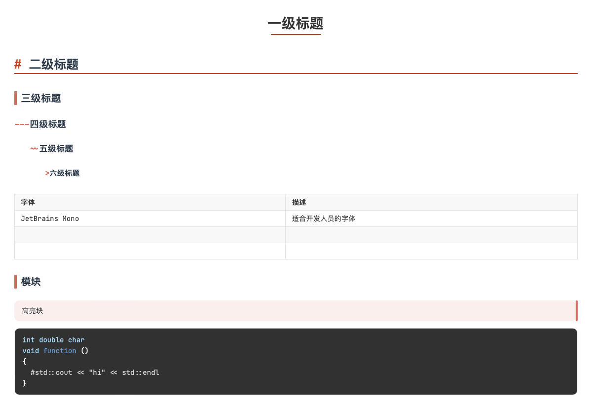

# Hi

## CN

### 打个招呼

哈喽我是yanlin，大一大学生。本仓库旨在分享旅游笔记。记得顺手点一下小星星噢

### 使用方法

* 目前搭配typora软件进行markdown语言编辑阅读

* Typora 中的CSS采用开源+自己魔改的（放在上面typora_tech文件夹）

  * reference [theme 1](https://github.com/liangjingkanji/DrakeTyporaTheme) [theme 2](https://github.com/Theigrams/My-Typora-Themes) 
  
    
  
* Latex 快捷键（辛苦研究了好久）

  * window 使用 autohotkey + gpt
  * mac bettertouchtool / hammerspoon
  
* others

## EN

### Hi

Hello, I am yanlin, please feel free to take my work to review for the respective course. Don't forget to subscribe and give my repo a small star. Thx!

* 

### Method

* currently I use typora as my markdown editor
* Using CSS originally from open source and edited after(put in Typora_tech folder)
  * reference [theme 1](https://github.com/liangjingkanji/DrakeTyporaTheme) [theme 2](https://github.com/Theigrams/My-Typora-Themes)

* Latex shortcut
  * **window:** autohotkey + gpt
  * **Mac:** bettertouchtool/ hammerspoon

* Others