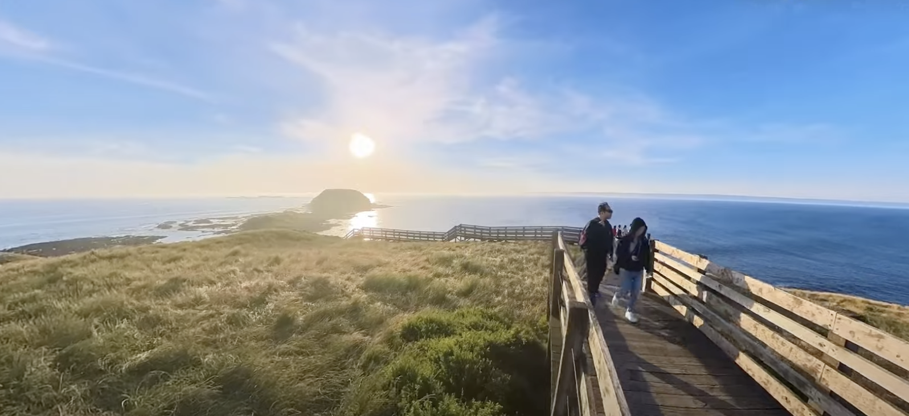

### 景点

Hosier Lane: 著名的涂鸦街

咖啡之都：非常多鸽子

巧克力店：Koko Black

街区拱廊：The Block Arcade (shopping mall) 风格很nice，维多利亚风格

Essensorie：网上比较出名的精品香薰

维多利亚州立图书馆：

Flinders Street Station:很有历史感的火车站，据说是澳洲第一个火车站

Queen Victoria Market:卖东西的集市，奶制品，鲜肉，蔬果；另一边是售卖纪念品的集市，感觉很有意思

Point Ormond Lookout: 可以看到城市景观和日落和海

Port of Melbourne 海景看落日很推荐

菲利普岛企鹅和蒸汽火车

Yarra River 雅拉河，走路，船啥的都行

Royal Botanic Gardens墨尔本（皇家植物园

St Patrick's Cathedral 反正是个教堂，挺好看

Parliament House 国会大厦

Carlton Gardens 这个草坪漂亮

#### 一日团

* Puffing Billy Railway 蒸汽火车 从Belgrave Station出发 -> Lakeside Station, 途经很出名的景点Monbulk Creek Trestle Bridge， 可以把脚伸出去体验，建议要坐靠月台的一边，风景更好看

* maru 考拉动物园 树熊，袋鼠，塔斯曼尼亚恶魔等

* 考斯小镇Cowes，一个海边旅游小镇，挺漂亮的

* 海豹岩 The Nobbies 景色特别好

* 菲利普岛小蓝企鹅归巢

### reference

[传送门](https://www.youtube.com/watch?v=rhab6dKpsuY&t=284s)

