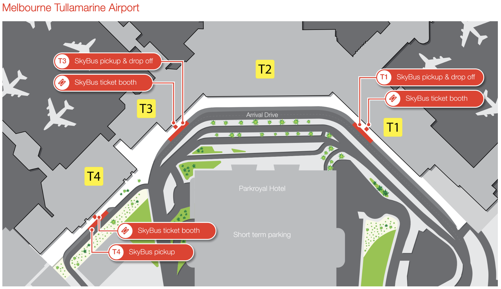
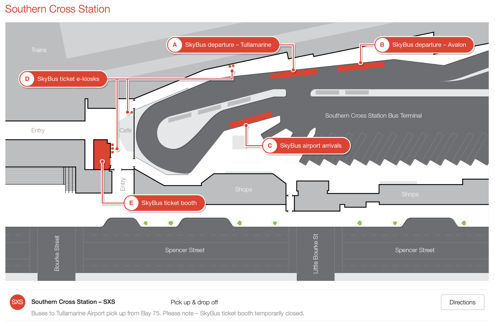
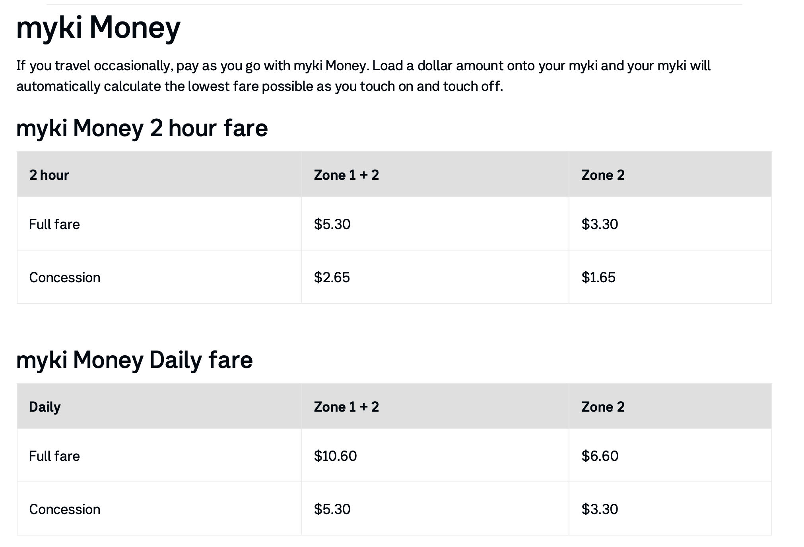
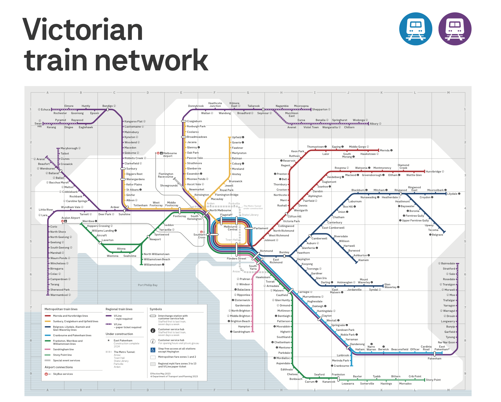
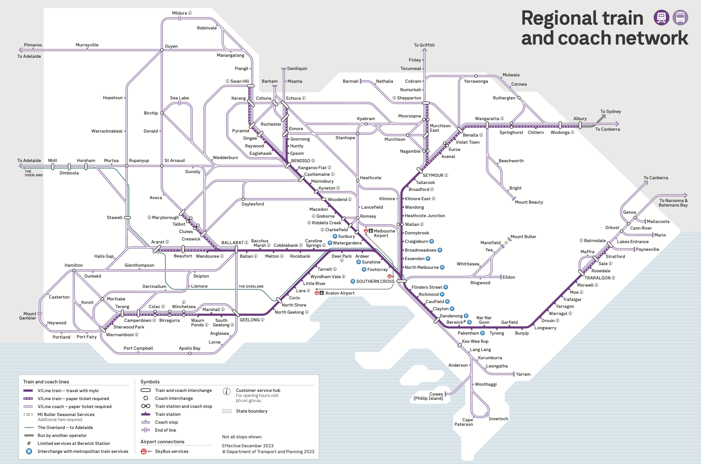
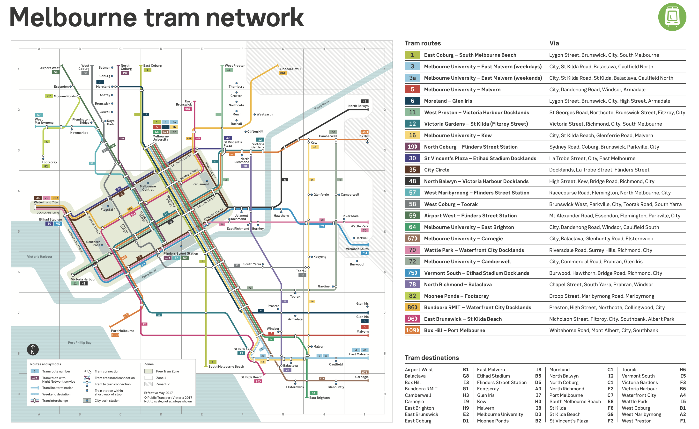
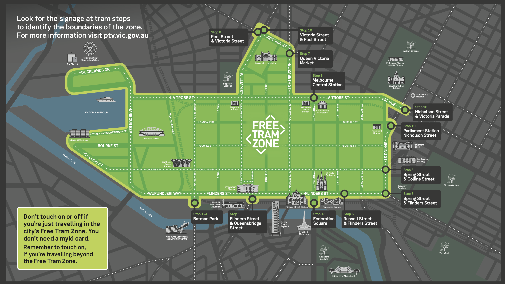

### 机场到市区

我们降落在墨尔本图拉马林机场，选择Skybus + Hotel Transfer Bus (走路）到达市区酒店

#### Skybus:

* Skybus 负责在南十字星车站和机场之间来往，营运时间从早上4点到凌晨1点，单程23.9USD(173RMB)，40USD(290RMB)往返，15分钟一班，只需35分钟就到，中间不停站，timetable可以在[官网](https://www.skybus.com.au/melbourne-city-express/)上找到。
* 机场出站口附近设有Skybus的售票亭及自动售票机，上面红底白字斜体写有“Skybus”，买好票排队等候就可以了。也可以用app或者线上，[skybus官网(https://www.skybus.com.au/melbourne-city-express/)。
* 售票亭可使用现金或银行卡支付，自动售票机24小时开放，但只可使用银行卡支付。
* klook也可以买，可以比较一下 105RMB单程，往返176RMB

[官网网址](https://www.skybus.com.au/melbourne-city-express/)

#### Hotel Transfer Bus

达到Skybus的终点站之后，我们可以在南十字火车站免费换乘小巴送到酒店,网友说最好留着Skybus的票，如果我们酒店不在名单里，他们也会想办法把我们弄到最近的地方。具体我们可以在火车站问Skybus Customer Service Officer或者网友说的Hotel Shuttle Booth(在下车左手边)看看怎么样的安排，不用提前订。如果需要等一会的话可以在附近逛一下，有locker

我们从火车站走去酒店就6分钟而已，很快，赢！

小巴运营时间：

* Mon-Fri: 06:00-22:30 
* Sat-Sun: 07:30-17:30

[官网地址](https://interasiapop.org/wp-content/uploads/2016/01/gettingthere.pdf) 打开酒店名单404，晚点再看看 

### Myki交通卡

Myki卡所有交通工具只能用Myki交通卡

上下电车和公交都要刷卡，火车是进出站都要刷卡

Myki空卡费为6澳币，5-18岁可以买小孩，19岁以上全票(full fare)。计费方式有两种，分为Myki Pass 和Myki Money 

#### Myki Pass

分为7天，28天-365天之间不等， 适合长期停留的小伙伴

如果通过Google Pay App 购买只能是特定天数的，但是如果在Mobile Myki Online 可以随便28-365之间的任何天数

7日票：ZONE1+2，53澳币

[计价官网](https://www.ptv.vic.gov.au/tickets/fares/metropolitan-fares/)

#### Myki Money

计算方式以搭乘时间和区域来计算，有每日上限优惠，周末和节假日会便宜

2小时：ZONE1+2 5澳币

当天上限：ZONE1+2 10澳币

系统会自动计算Myki交通卡的使用时间和上限，所以上下车要记得刷卡

[计价官网](https://www.ptv.vic.gov.au/tickets/fares/metropolitan-fares/)

#### Myki Explorer

Myki Explorer是針對觀光客所販售的Myki，一張是15澳幣，包含6元的卡片費用以及9澳幣的Myki Money在裡面，另外包含一天的免費交通。這麼看起來Myki Explorer其實沒有比較便宜，而Myki Explorer唯一的好處就是，到訪墨爾本16個出名景能夠享有折扣優惠

#### 购卡和增值

* 在火车站和路面电车等车的地方可以找到Myki Machine 来购买 Myki 卡，或者7 11

* Myki Machine和手机都可以增值

#### Reminder

基本市区的热门景点都可以坐免费电车，更远的直接一日团

### 市区交通

墨尔本市区交通是非常方便的，主要的大众交通工具有三种：火车(train&V-Line)、有轨电车(tram)和汽车(bus)。这三种交通工具的线路遍布了墨尔本的所有区域，通过换车你可以到达墨尔本的各个角落。

其中最快的是火车，有轨电车的特点是在地面上行驶，可以欣赏沿途的风景，汽车则可以去一些火车和有轨电车不能直接到达的地方。交通一卡通Myki卡可以通用，上下车刷卡扣费(后面Myki卡会攻略会详细介绍)。

还有V-Line虽然也属于火车，但是和以上的三种交通不属于同一家公司，所以也可以使用Myki卡，但是价格是另外算的。出租车作为其它交通工具的补充，可以更灵活的去到墨尔本市区的各个地方。

#### 铁路（train）

类似日本铁路，或者说地铁。拥有16条火车线路通往城市周边的郊区，所有车站都和巴士站和电车站相连。位于Flinders Street和Swanston Street交叉的Flinders Street Station是所有train的始发站和终点站

[Train线路地图](https://ds12k1658w1f2.cloudfront.net/wp-content/uploads/2023/05/PTVH5934-Network_Victorian_Train_Map_A1_P_Snapcase18mm_May-2023_v3_FA_OL.pdf) 

[Train官网](https://www.metrotrains.com.au)

运营时间：

Mon-Thu: 05:00 - 24:00

Fri-Sat: 05:00 - 01:00

Sun: 07:00 - 23:00

白天的Train通常10-20min一班，晚上班次相对较少

#### 城际铁路（&V-Line）

V/Line 共有五条线路：Bendigo 线， Seymour线，Gippsland线，Geelong 线和Ballarat线. 如果您需要往返于墨尔本个和维多利亚各区域城市之间，V/Line是最方便快捷的选择。

[V-line network](https://www.vline.com.au/getattachment/f8a1e2c3-5d60-4abe-b608-2bc18e9f8197/V-Line-Network-Map) [V-line官网](https://www.vline.com.au)

V/Line的车票分为单程，往返，周票，月票等等;Myki可以在V/Line使用，不过价格是另外算的，具体的价格计算可利用官网提供的价格计算器。

[V-line plan journey链接](https://www.vline.com.au/Plan-trip-buy-tickets)

另外，如果是非高峰时段乘坐的话，票价有7折的优惠。非高峰时段指：周一至周五9点之前“刷出”墨尔本车站，16点至18点“刷入”墨尔本车站。

#### 有轨电车（tram）

tram有轨电车是墨尔本的主要公交工具之一，属轨道交通的一部分，特点就是以city为中心，向周边各个区镇辐射开。有轨电车是墨尔本的特色之一，在整个澳大利亚，只有墨尔本拥有有轨电车。有轨电车分为付费的电车与免费的环线市区电车 (City Loop)。乘坐付费电车需使用Myki卡。

[tram network](https://www.ptv.vic.gov.au/assets/PDFs/Maps/Network-maps/417bb4810a/PTV_Tram-Network-Map_2017.pdf)

Flinder st.：水族馆、联邦广场、圣保罗教堂、弗林德街车站、涂鸦巷、
Spring st.：唐人街、国会大厦、皇家展览馆、墨尔本博物馆
La trobe st.：维多利亚女王市场

[tram free zone](https://www.ptv.vic.gov.au/assets/PDFs/Maps/Network-maps/5b4a3efe80/PTV-Free-Tram-Zone-Map.pdf)

沿着这个Free Tram Zone有个很出名的环线35路车(route 35) 可以覆盖到沿线主要市区景点，每个景点还有相应的英文解说，freezone里有标志的

运营时间：

Sun-Wed: 10:00 - 18:00

Thu-Sat: 10:00 - 21:00

每12min一班，双向对开，随时上车下车

上下车都在绿色区域内饰免费的，超出这个范围要收费。

#### 巴士（bus）

比较复杂，很多线没有报站，下车需要按铃，不然会直接错过，15-30min一班。

也有专门的观光巴士，不过要收费

观光巴士运营时间：9:30 -16:30

#### 出租车（taxi）

比较贵，深夜直接uber吧

#### 出行规划

可以通过PTV(Public Transport Victoria)网站的行程规划器(journey planner)或者PTV手机应用来规划

[journey planner PTV](https://www.ptv.vic.gov.au/journey/)

#### 轮渡

一般只为观光服务，本地人不坐

* Southbank（市中心） - Williamstown
* Queenscliff - Sorrent  往返贝拉林半岛（离大洋路很近）和企鹅岛 ；码头距离墨尔本有1小时车程，可以驾车上船，一般从企鹅岛直接去到大洋路
* 塔斯马尼亚 devonport，比较贵

#### 参考

[马蜂窝介绍](https://www.mafengwo.cn/gonglve/ziyouxing/320532.html)

市中心Free Tram Zone范围内乘电车不用钱，单程收费5刀，一天最多收费10刀，假日最多收费7.2刀

[myki攻略](https://chakekeke.com/melbourne-transport/#➀-一般電車)

[补充攻略](https://www.kkday.com/zh-hk/blog/15301/australia-melbourne-transportation)
