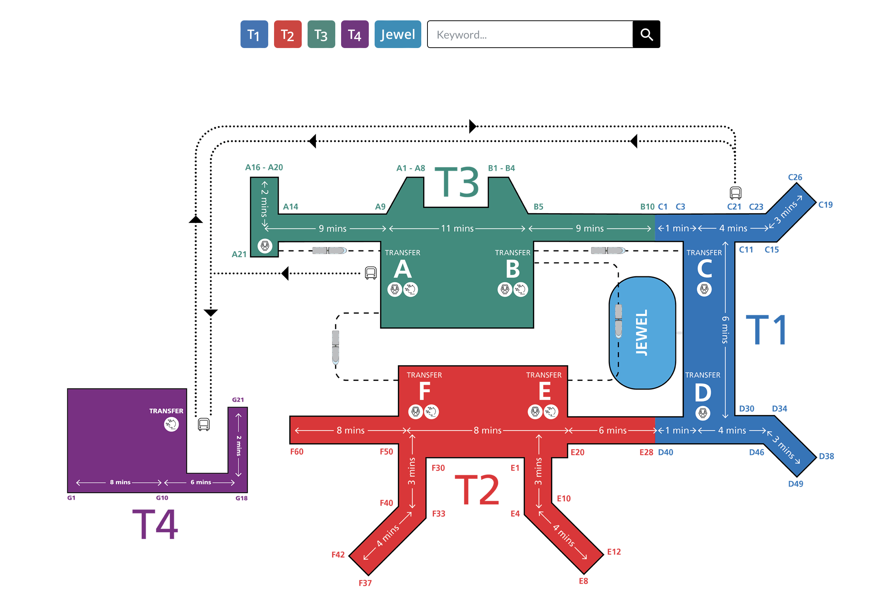
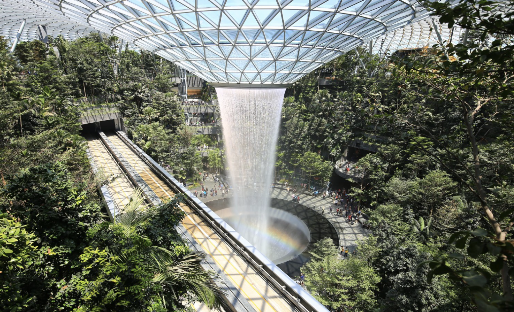

### 交通方式

#### 地铁(SMRT)

下飞机坐skytrain去T3航站楼跟着指示牌就可以去坐地铁的地方

运营时间为5:00-23:50，地铁票券种类分为三种

##### 交通卡:

* 在下面单独介绍

##### 单程普通票:

* 车站里有售卖
* 第一次买单程普通票会加收0.1新币作为订金限当天使用。
* 购买30天内可增值使用6次，使用第三次会退回0.1新币的订金，使用第六次有0.1新币的折扣（还不是很懂

##### 游客通行卡:

* 一日券（8新币）

#### 公交

主要的巴士线路在SBS Transit和SMRT和这两家公司上

##### SBS Transit:

* 有空调0.8-1.7新，无空调0.7-1.4新，不设找零

##### 付费:

* 现金，但是不同目的地不同价格需要提前问好
* 交通卡

##### 注意事项:

  * 前门上车刷卡扣除整条线路的最高费用，下车再刷一下退回没用到的钱 所以要记得下车刷卡 
    * 大多数巴士不报站， 车上没有线路图，巴士进站要招手示意司机停下，下车前要按铃，不然会错过车
    * 公交公司有自己的手机应用，可以查询最近的公交车次以及还有多少分钟到达

#### 交通卡

##### EZlink：

* 类似西瓜卡，用这张卡可以搭乘地铁公交和轻轨，
* 每张卖10-12新不等， 包括无法退还的5新币工本费和剩下新币的储值金。如果EZlink的储值金少于3块是不能用的，要增值，每次最少增值10新币

* 用EZlink转乘有比较大的优惠，会比单程票优惠一些
* 也有专门自由行的1/2/3天无限EZlink交通卡，分别为22/26/30新，其中包含10新租金（使用到期退回）

##### NETS：

* 只能用于支付地铁和公交

#### 出租车

不同颜色的出租车价格不一样，黑色是最贵的

#### 打车

Uber/Easy Taxi/GrabTaxi 新加坡三大打车软件

### 景点参考

#### 新国立

免费参观，餐厅对外开放但是对访客不同价格

[self-guided tour](https://cde.nus.edu.sg/undergraduate/pre-university-engagement-campustours-selfguidedtour/)

#### Citywalk

牛车水-珍珠坊-佛牙寺-印度寺

* 鱼尾狮公园
* 滨海湾公园
* 坤成路(Koon Seng Rd) --华人街屋
* 甘榜格南(kampong glam) --苏丹风格
* 小印度(Little India) --印度

### 星耀樟宜

#### 机场分布：

* T1/T2/T3之间有skytrain
* T4需要坐摆渡车去到T2/T3

#### 丛林小火车

* skytrain同时有禁区内外的游客，分不同车厢和开门方向，可以不用入境就看瀑布

* T2-T3 在左边， T3-T2在右边，可以不下车坐过去再坐回来

#### 营业时间：

* 星耀樟宜24h营业
* skytrain营业时间 每日凌晨04:30至次日凌晨1:30
* 商店营业时间10:00-22:00
* 瀑布营业时间11:00-22:00（假日10:00-22:00）
* 瀑布灯光秀时间为20:00，21:00（假日还有22:00）
* 其他星耀樟宜设施景点营业时间为10:00-22:00

#### 景点分布：

瀑布在一楼，森林谷植物园从一楼到四楼，这俩是免费的。其他付费景点在5楼

### 购物

* 克拉码头(Clarke Quay)
* 维多利亚街(bugis street)
* (Orchard Road) --购物中心，奢侈品啥的
* 金沙酒店商场(Shoppes at Marina Bay Sand)

### 饭

* yakun亚坤早餐 比较有特色的东西（咖椰吐司和半熟的蛋

* 维多利亚街(bugis street)
* (Hawker Center)
* 了凡油鸡面(Soya Sauce Chicken Rice & Noodle)
  * 最便宜米其林一星

### 小知识

* 在小吃街吃完饭盘子要自觉回收，不然要被罚款
* 小吃街，咖啡店桌上的纸巾不要随便拿，是占位的
* 咖啡喝到一半中途出去要把勺子在杯子上平放才不会被收走
* 逛商场不要随便接试用装，会被拉去消费

### 罚款条例

* 禁止喂食野生动物（鸽子）500新
* 禁止破解别人wifi 最高1w新/3年监禁
* 禁止在地铁饮食 最高500新
* 禁止买卖口香糖
* 禁止破坏公务，包括涂抹墙面 最高2000新/3年监禁
* 禁止乱穿马路 50新
* 禁止乱扔垃圾 轻则300新，重则2000新
* 禁止随处吸烟 1000新
* 禁止开车玩手机 1000新/6个月监禁
* 禁止在公共场所唱歌

### 参考网站

[新加坡地铁卡EZlink介绍](https://www.bugi.tw/2015/08/ezlink.html)

[新加坡EZlink和NETS对比](https://www.sgplanking.com/article/762854)

[新加坡交通参考](https://www.sgplanking.com/article/762854)

[新加坡公交车/巴士乘坐攻略](https://www.mafengwo.cn/gonglve/ziyouxing/1106.html)

[樟宜机场官方航站楼图](https://www.changiairport.com/en/maps.html)

[樟宜机场官方航站楼穿梭方案](https://www.changiairport.com/zh/airport-guide/transport/transfer-between-terminals-and-jewel.html)

[星耀樟宜攻略](https://retrievertrip.com/星耀樟宜/)

[星耀樟宜skytrain问题](https://www.trainnets.com/archives/38613) 这里的瀑布时间和skytrain时间应该是错的 2019年的自律