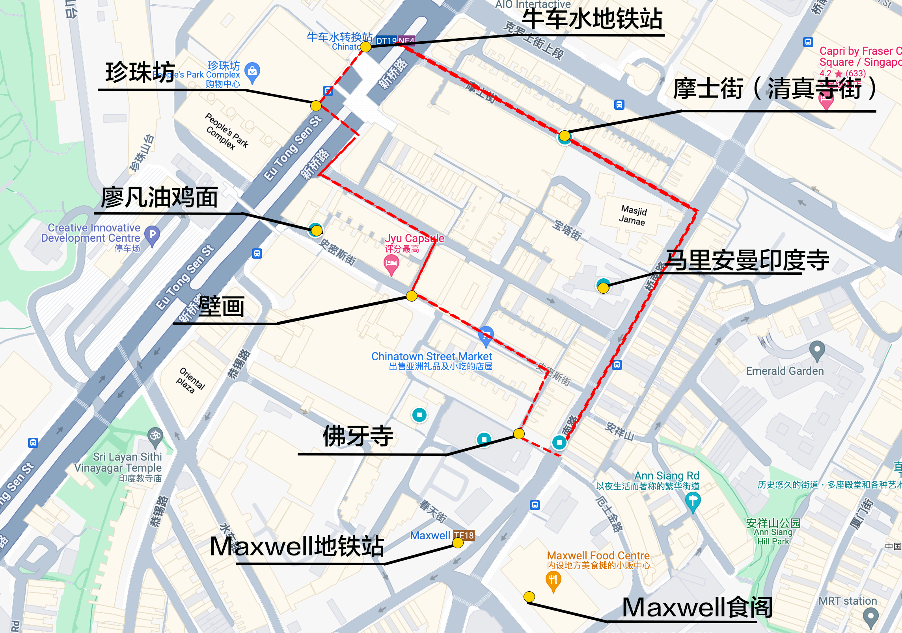
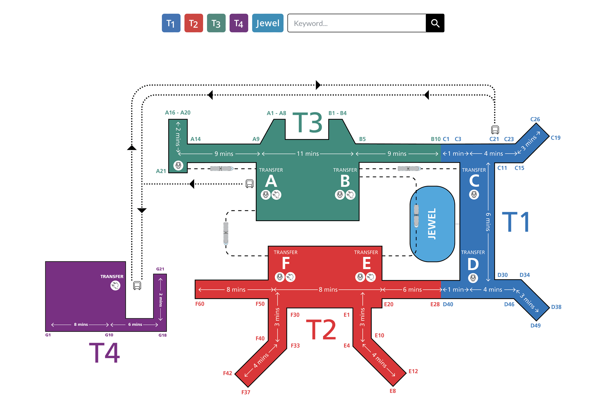
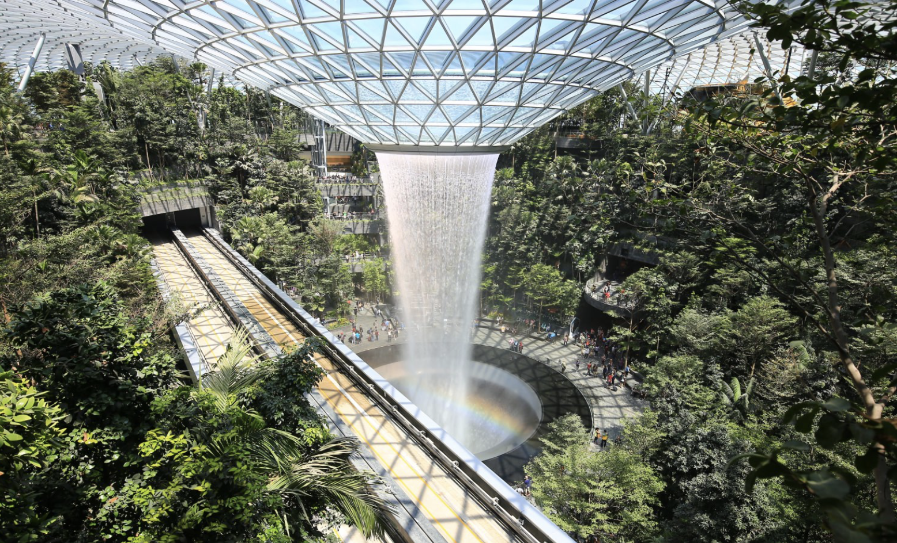

### 景点参考

#### 新国立

免费参观，餐厅对外开放但是对访客不同价格，两个图书馆取消门卡制度

[self-guided tour](https://cde.nus.edu.sg/undergraduate/pre-university-engagement-campustours-selfguidedtour/)

#### Citywalk

牛车水-珍珠坊-佛牙寺-印度寺

* 鱼尾狮公园
* 滨海湾公园
* 坤成路(Koon Seng Rd) --华人街屋
* 甘榜格南(kampong glam) --苏丹风格
* 小印度(Little India) --印度

### 星耀樟宜

#### 机场分布：

* T1/T2/T3之间有skytrain
* T4需要坐摆渡车去到T2/T3

#### 丛林小火车

* skytrain同时有禁区内外的游客，分不同车厢和开门方向，可以不用入境就看瀑布

* T2-T3 在左边， T3-T2在右边，可以不下车坐过去再坐回来

#### 营业时间：

* 星耀樟宜24h营业
* skytrain营业时间 每日凌晨04:30至次日凌晨1:30
* 商店营业时间10:00-22:00
* 瀑布营业时间11:00-22:00（假日10:00-22:00）
* 瀑布灯光秀时间为20:00，21:00（假日还有22:00）
* 其他星耀樟宜设施景点营业时间为10:00-22:00

#### 景点分布：

瀑布在一楼，森林谷植物园从一楼到四楼，这俩是免费的。其他付费景点在5楼

### 购物

* 克拉码头(Clarke Quay)
* 维多利亚街(bugis street)
* (Orchard Road) --购物中心，奢侈品啥的
* 金沙酒店商场(Shoppes at Marina Bay Sand)

* Tokyo Milk Factory（饼干
* Bacha Coffee

### 烟花

完美错过！

从6月15-8月9每周六晚都有烟花
